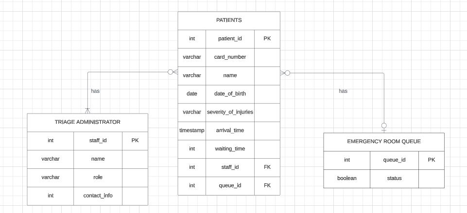

# Hospital Triage Database Design Documentation

## Entities Description

### Patients
This entity encompasses comprehensive information about individuals seeking medical attention, comprising both personal details and medical triage data.

### Administrator
This entity stores information about staffs or administrators, so we will know which staff will be assigned to which patient.

### Room
This entity stores information regarding available patient care rooms, monitoring the status of each room and the assigned medical personnel.

## Attributes Specification

### Patients Attributes:
- `patient_id` (integer): A unique identifier for each patient.
- `card_number` (varchar): The identification number on a patient's medical card.
- `name` (varchar): The full name of the patient.
- `date_of_birth` (date): The birthdate of the patient.
- `severity_of_injuries` (varchar): A description of the patient's medical issue.
- `arrival_time` (timestamp): The date and time when the patient arrived at the hospital.
- `staff_id` (integer): A reference to the Administrator entity, indicating the staff information who will associate with that patien.
- `queue_id` (integer): A reference to the Room entity, indicating the patient's assigned room (if any).

### Administrator Attributes:
- `staff_id` (integer): A unique identifier for each triage staff.
- `name` (varchar): The full name of the staff or administrator.
- `role` (varchar): The role of the staff (e.g., Triage Nurse, Administrator)
- `contact_info` (varchar): Phone number or other contact details for the staff or administrator.

### Room Attributes:
- `queue_id` (integer): A unique identifier for each entry in the emergency room queue.
- `status` (boolean): The occupancy status of the room; 'true' if occupied, 'false' if available

## Database ERD (Entity-Relationship Diagram)

The ERD illustrates the relationships between entities. The `Patients` entity is connected to the `Administrator` and `Room` entities through foreign keys, indicating the relationship between a patient - staff and their room assignment.